# SecureApp - Enterprise Architecture Workshop

## Autor
Cristian Silva

## Descripcion general
Este proyecto documenta la implementacion de una aplicacion web segura y escalable desplegada en AWS, siguiendo el taller **Enterprise Architecture Workshop: Secure Application Design**.

La solucion se compone de dos servidores separados:

- **Frontend (EC2 1 + Apache):** publica un cliente HTML + JavaScript asincrono desde la carpeta `client/`.
- **Backend (EC2 2 + Spring):** expone servicios REST para autenticacion y consumo de funcionalidades protegidas.

Ambos servicios se publican sobre HTTPS/TLS para proteger la comunicacion extremo a extremo.

## Lo realizado en el taller
- Diseno de arquitectura separada por capas (cliente y API en instancias EC2 diferentes).
- Despliegue del frontend en Apache sobre Amazon Linux.
- Despliegue del backend Spring Boot en una segunda instancia EC2 (Amazon Linux).
- Proteccion de trafico con TLS (certificados de Let's Encrypt, segun guia del taller).
- Implementacion de autenticacion de login con manejo seguro de credenciales (hash de contrasenas).
- Integracion frontend-backend mediante llamadas asincronas a endpoints REST.

## Arquitectura implementada
1. El usuario accede al frontend por HTTPS en la instancia Apache.
2. El cliente JS consume endpoints REST del backend Spring tambien por HTTPS.
3. El backend procesa autenticacion/autorizacion y retorna respuestas JSON.
4. El frontend renderiza resultados de forma asincrona sin recargar pagina.

## Seguridad aplicada
- **TLS en ambos servidores:** cifrado en transito para frontend y backend.
- **Credenciales seguras:** contrasenas almacenadas como hash.
- **API REST protegida:** acceso controlado a endpoints segun autenticacion.
- **Separacion de servicios:** menor superficie de ataque al aislar frontend y backend.

## Estructura relevante del proyecto
- `client/`: frontend HTML + JavaScript asincrono servido por Apache.
- `src/main/java/`: codigo fuente del backend Spring Boot.
- `src/main/resources/`: configuraciones del backend.
- `images/`: evidencias del proceso y pruebas.

## Evidencia (capturas en orden)
> Nota: Las imagenes se muestran en secuencia numerada para documentar el flujo del taller.

### 1) Preparacion y despliegue de infraestructura
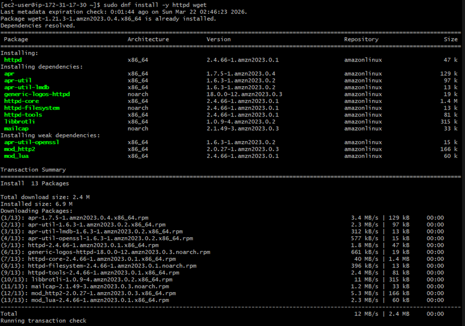
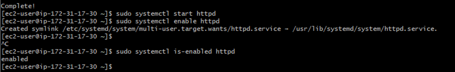
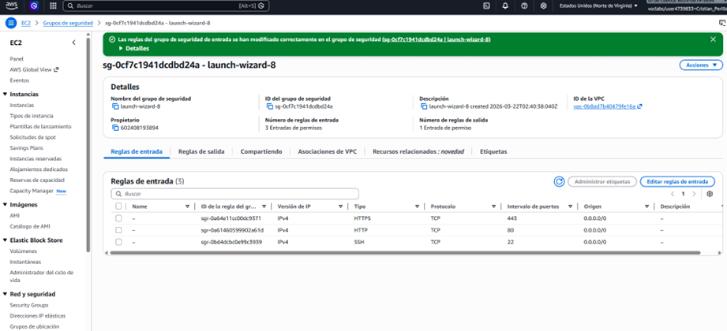
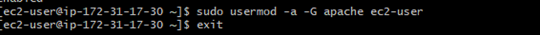
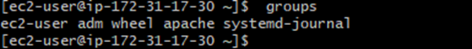

### 2) Configuracion del frontend en Apache (EC2 1)
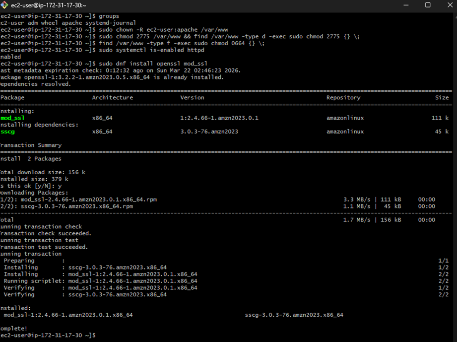
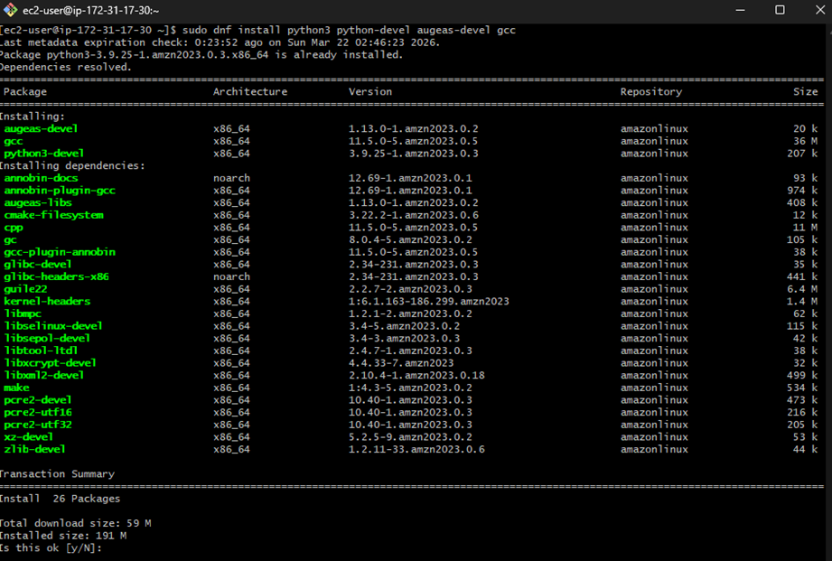
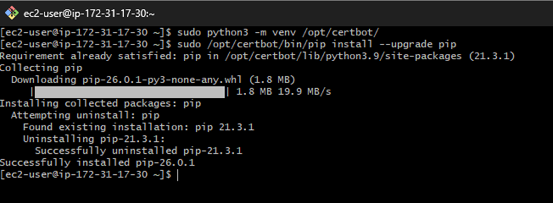
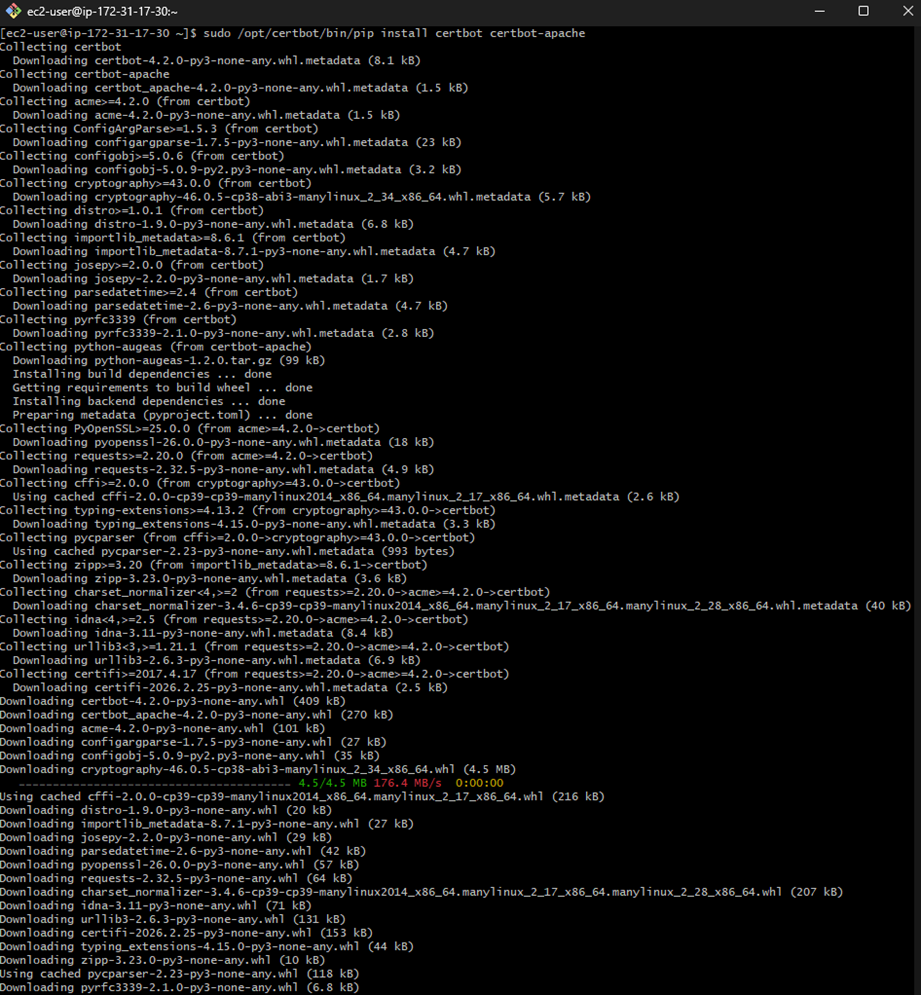

### 3) Configuracion del backend Spring (EC2 2)
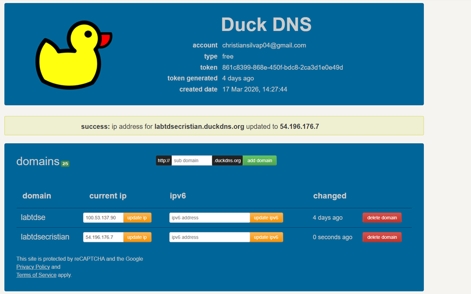
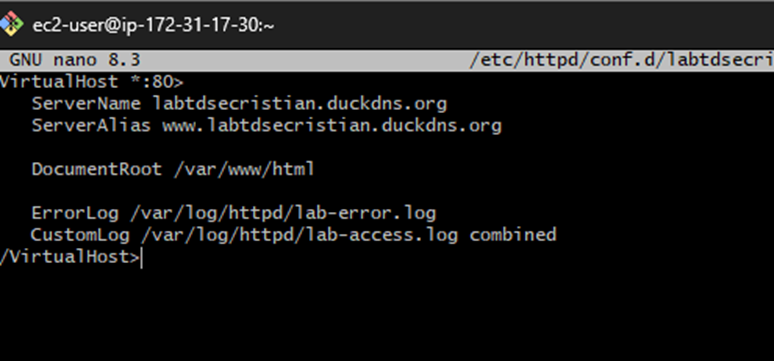
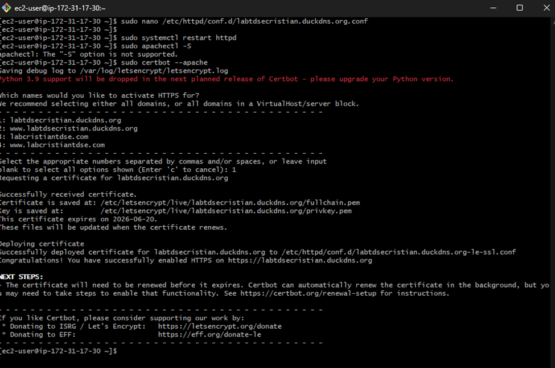
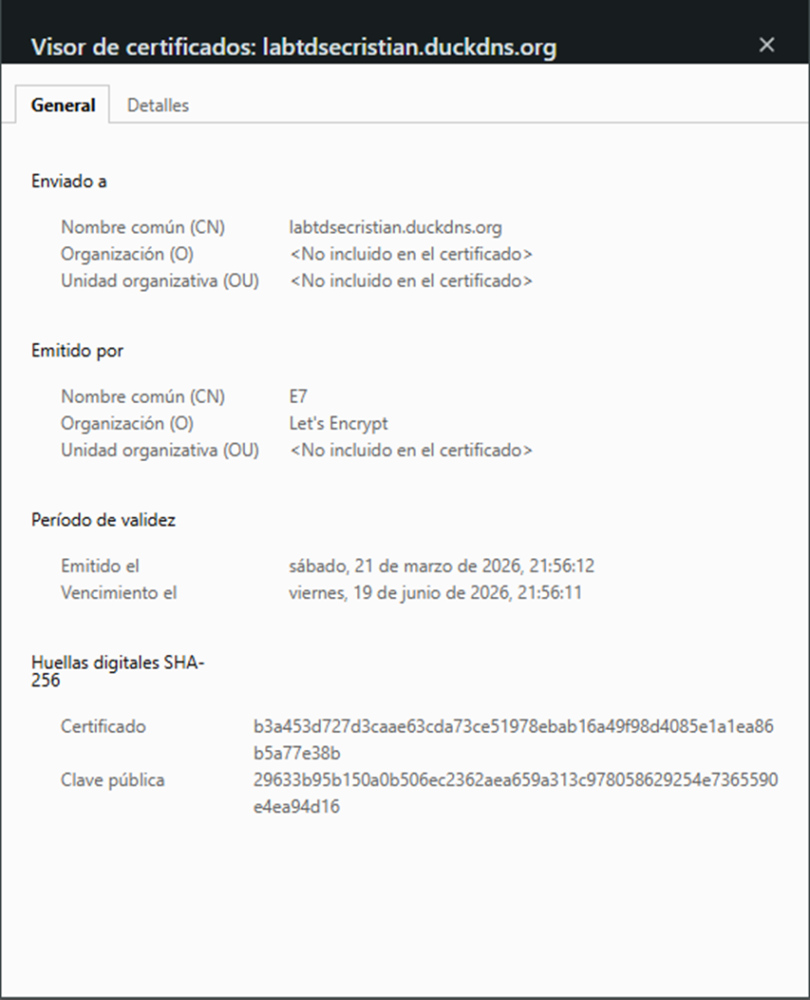
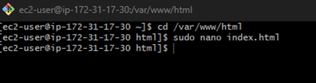

### 4) Seguridad, TLS y pruebas funcionales
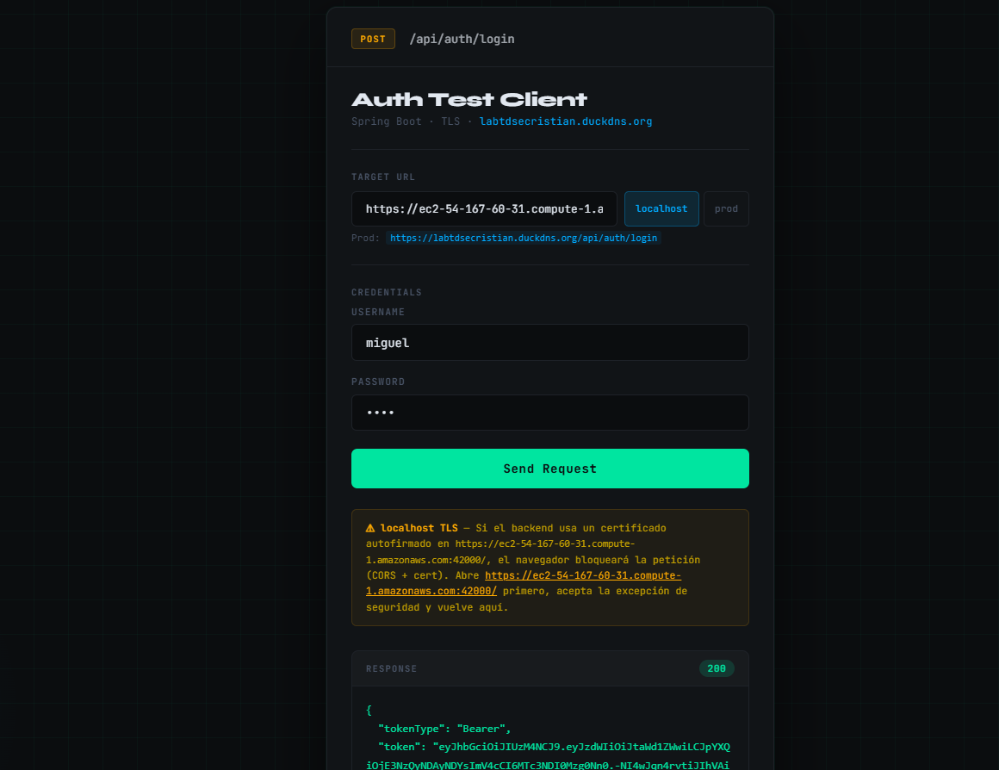
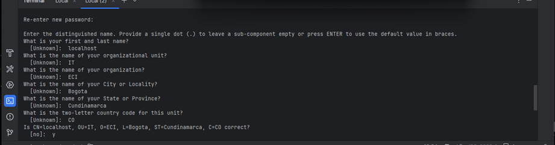
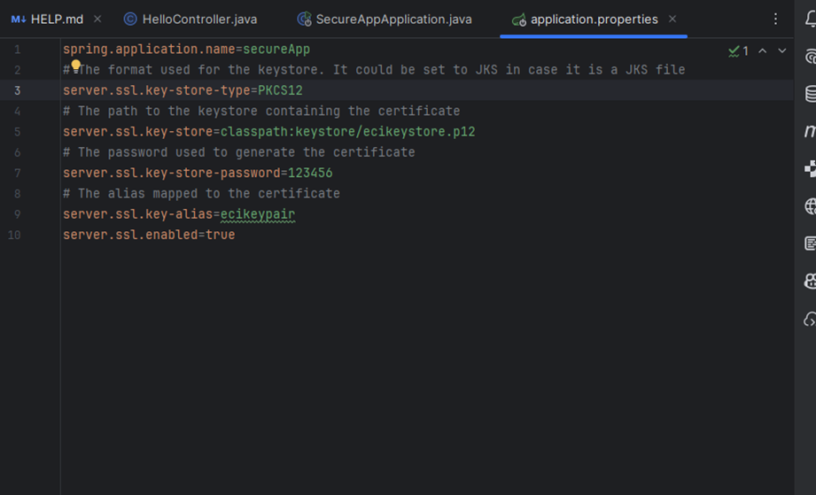
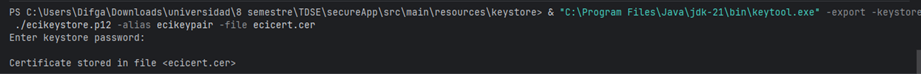
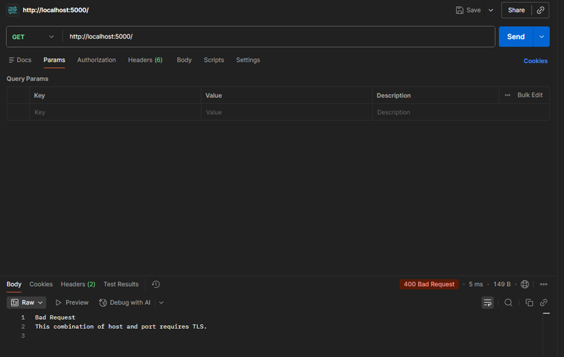
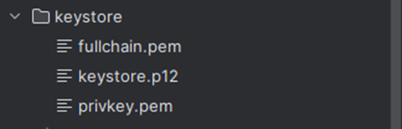

### 5) Validacion final e integracion completa
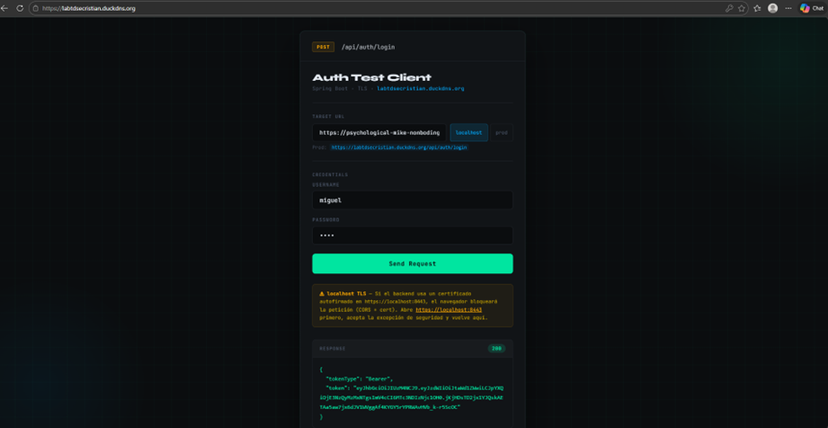
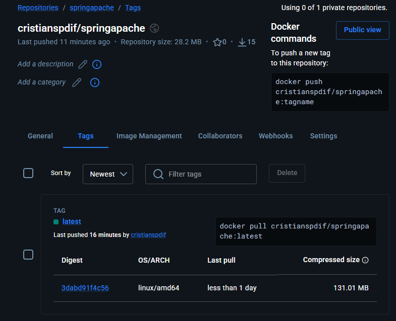

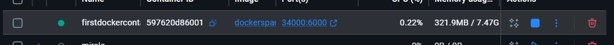

## Referencias
- Guia base AWS (Amazon Linux 2023): https://docs.aws.amazon.com/linux/al2023/ug/ec2-lamp-amazon-linux-2023.html
- Tutorial de apoyo: **TallerAllSecureAppSpring**

## Video demostrativo

